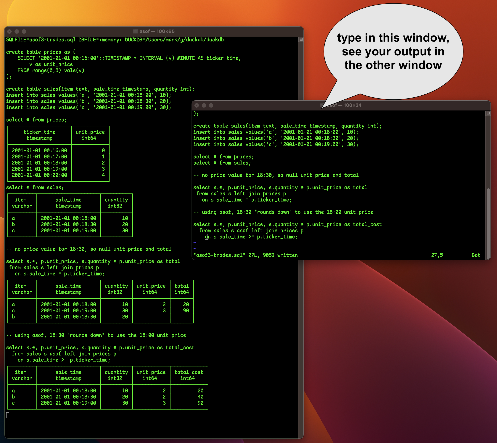

# duckdb_tools

Some handy things for duckdb.

## obfuscate\_ddb

Replaces all text fields in a database with hash strings.  The hash strings
are consistent, so keys are preserved, etc.

WARNING: OVERWRITES THE ORIGINAL DATA, USE THIS ONLY ON A COPY.

usage:  obfuscate\_ddb.py database-file.ddb

## duckwatch -- type SQL in an editor and see the duckdb output.

Type SQL into an editor, and see the output in another window.  Handy if you're
experimenting and want to keep your SQL around.  Also nice if you're doing multi-line
queries and don't want to zap your formatting when you press enter to see the results.
Think of it as the poor programmer's answer to a real IDE!

